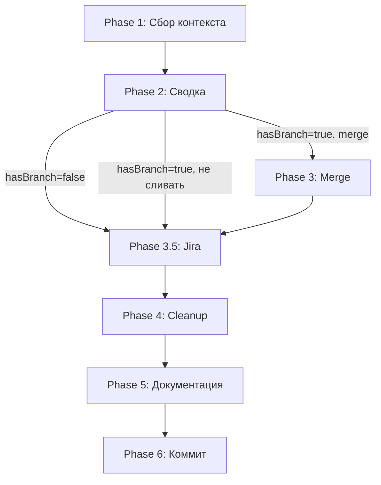

# Feature Accept — принятие готовой фичи

Этот скилл закрывает цикл разработки фичи: при необходимости сливает **отдельную** feature-ветку (только если она зафиксирована в документации), опционально закрывает задачу в Jira, чистит временные артефакты и актуализирует документацию.

---

## Phase 1: Сбор контекста

Сначала найди каталог фичи и прочитай `docs/features/{slug}/README.md`.

Из README извлеки:

- **Git-ветка:** — имя feature-ветки или явное «не требуется» (как в **feature-planning**).
- **Базовая ветка для merge:** — ветка для слияния (например `main`, `develop`). Игнорируй «не применимо» / пусто.

### Флаг `hasBranch` (обязательно)

Определи, создавалась ли ветка **под эту фичу** по документации:

- **`hasBranch = false`** — если значение поля **Git-ветка** после нормализации (без обратных кавычек, trim) равно **«не требуется»** или однозначно означает отсутствие отдельной ветки.
- **`hasBranch = true`** — если указано **конкретное имя ветки** (например `feature/dark-mode`).

Если поле **Git-ветка** отсутствует, неоднозначно или не совпадает с ожиданиями — **спроси у пользователя**: «Для этой фичи создавалась отдельная git-ветка?» и выставь `hasBranch` по ответу.

Обозначение: `mergeBase` = **Базовая ветка для merge** из README, если поле заполнено и не «не применимо»; иначе спроси у пользователя основную ветку или используй `main` только как последний fallback.

Выполни **параллельно** через Bash:

1. `git branch --show-current` — текущая ветка
2. `git status --short` — проверить что нет незакоммиченных изменений
3. **Только если `hasBranch = true` и известен `mergeBase`:** `git log <mergeBase>..HEAD --oneline` — список коммитов фичи
4. `ls docs/features/` — найти директорию фичи (если ещё не найдена)

**Если есть незакоммиченные изменения** — предложи пользователю сначала закоммитить (можно через скилл `git-commit-and-push`). Не продолжай пока рабочее дерево не чистое.

**Если директория фичи не находится автоматически** — спроси у пользователя путь.

**Если в README нет «Базовая ветка для merge»** (старая документация) — уточни у пользователя целевую ветку для merge и используй её как `mergeBase` **только когда** `hasBranch = true` и планируется merge.

Прочитай файлы фичи:

- `docs/features/{slug}/README.md`
- `docs/features/{slug}/spec.md`
- `docs/features/{slug}/checklist.md` (если есть)

---

## Phase 2: Сводка и подтверждение

Покажи пользователю краткую сводку:

```
Фича: {название из README.md}
Отдельная feature-ветка по документации: {да / нет (hasBranch)}
Имя ветки из README: {значение Git-ветка или «не требуется»}
Текущая ветка (git): {git branch --show-current}
Цель merge из README: {Базовая ветка для merge или «не задана» / не применимо}
Коммитов (feature..base): {N или «не считалось — ветка не для фичи»}
Статус чеклиста: {X из Y выполнено}
Merge: {если hasBranch=false — «не требуется (ветка не создавалась)»; иначе — «требуется уточнение ниже»}
```

### Если `hasBranch = false`

**Не предлагай** вопрос «Куда сливать ветку?» — merge по плану фичи не предусмотрен. Сразу переходи к **Phase 3.5: Jira** (после краткого подтверждения пользователем, что можно продолжать без merge — одной репликой «продолжаем» достаточно, или явно спроси: «Продолжить без merge?»).

### Если `hasBranch = true`

Спроси через AskUserQuestion:

**Вопрос:** «Куда сливать ветку?»

- `{mergeBase из README}` (Рекомендуется — из документации фичи)
- Другая ветка (пользователь укажет)
- Не сливать (только cleanup и дальше по скиллу)

После ответа: при выборе merge — **Phase 3**; при «Не сливать» — сразу **Phase 3.5**, затем Phase 4.

---

## Phase 3: Merge

Выполняй **только если** `hasBranch = true` **и** пользователь в Phase 2 выбрал merge в целевую ветку.

```bash
git checkout <target-branch>
git merge <feature-branch>
```

**При конфликтах** — остановись, сообщи пользователю список конфликтных файлов. Не пытайся разрешить автоматически.

**После успешного merge** — сохрани diff для Phase 5:

```bash
git diff <target-branch>~<N>..<target-branch> --stat
```

Затем переходи к **Phase 3.5: Jira**.

---

## Phase 3.5: Jira (опционально)

Цель — при подключённом MCP Jira спросить, нужно ли перевести связанную задачу в статус **«Готово»**.

### 3.5.1 Проверка MCP

Попробуй вызвать MCP-сервер **jira** (или **user-jira**, как настроено у пользователя), инструмент **`jira_get_current_user`**.

- Если вызов **недоступен** (нет MCP, ошибка подключения) — **молча пропусти** эту фазу и переходи к Phase 4.
- Если вызов **успешен** — MCP считается доступным, переходи к 3.5.2.

### 3.5.2 Вопрос пользователю

Спроси через AskUserQuestion:

**Вопрос:** «Закрыть связанную задачу в Jira (перевести в «Готово»)?»

- Да
- Нет

Если **Нет** — переходи к Phase 4.

### 3.5.3 Ключ задачи и подтверждение

Если **Да** — **обязательно** запроси у пользователя **ключ или ссылку** на задачу (например `SER-5316` или URL issue). Из ссылки извлеки ключ (`PROJECT-123`).

1. Вызови **`jira_get_issue`** с `issueKey` — покажи пользователю **текущий статус** и **summary** для проверки.
2. Если задача не найдена — сообщи об ошибке, предложи ввести другой ключ (см. Safety Rules). Не переходи к обновлению статуса без валидного issue.
3. Спроси подтверждение: «Перевести задачу **{KEY}**: *{summary}* в статус **Готово**?»
4. При подтверждении вызови **`jira_update_issue`** с параметрами:
   - `issueKey`: извлечённый ключ
   - `status`: **`Done`** (если в инстансе Jira статус на английском; если workflow использует другое имя — после ошибки API попробуй **`Готово`** или уточни у пользователя точное имя статуса из Jira)

Если обновление статуса вернуло ошибку (недопустимый переход workflow) — **не повторяй вслепую**; выведи текст ошибки и предложи пользователю перевести задачу вручную или назвать допустимый статус.

После успешного обновления или явного отказа пользователя — **Phase 4**.

---

## Phase 4: Cleanup артефактов

Удали временные файлы фичи:

| Файл | Действие |
|------|----------|
| `docs/features/{slug}/starter-prompt.md` | Удалить |
| `docs/features/{slug}/checklist.md` | Удалить |

Обнови `docs/features/{slug}/README.md`:

- Статус → **Done**
- Добавь дату завершения: `Завершено: YYYY-MM-DD`

**Не удаляй** `spec.md` и `README.md` — они остаются как документация фичи.

---

## Phase 5: Актуализация документации

### 5.1 Проверь spec.md

Сравни `spec.md` с реально реализованным кодом:

- Используй Explore-агент (Agent tool с subagent_type=Explore) для анализа изменений фичи
- Если есть расхождения (нереализованные пункты, дополнительная функциональность) — обнови `spec.md`
- Добавь секцию «Отклонения от плана» если были существенные изменения

### 5.2 Проверь CLAUDE.md проекта

Если фича добавила:

- Новые пакеты/зависимости
- Новые команды
- Новые архитектурные компоненты
- Изменения в структуре проекта

→ Обнови соответствующие секции в `CLAUDE.md` проекта.

---

## Phase 6: Финальный коммит

Закоммить все cleanup-изменения одним коммитом:

```
docs: accept feature "{название}" — cleanup and update docs
```

Спроси через AskUserQuestion:

**Вопрос 1:** «Запушить изменения?»

- Да, push
- Нет, только локально

**Вопрос 2:** «Удалить feature-ветку?» — задавай **только если `hasBranch = true`**.

- Да, удалить локально и remote
- Да, только локально
- Нет, оставить

Если `hasBranch = false` — не спрашивай про удаление ветки (отдельной feature-ветки по документации не было).

---

## Safety Rules

| Ситуация | Действие |
|----------|----------|
| Незакоммиченные изменения | Стоп. Сначала коммит |
| Конфликты при merge | Стоп. Сообщить пользователю |
| Нет директории фичи в docs/ | Спросить путь или пропустить cleanup |
| `hasBranch = false` | Не предлагать merge и не спрашивать про удаление feature-ветки в Phase 6 |
| `hasBranch = true`, неясна цель merge | Взять **Базовая ветка для merge** из README; если нет — спросить у пользователя |
| Feature-ветка = main | Отказать. Нельзя мержить main в main |
| Jira MCP недоступен | Пропустить Phase 3.5 без ошибки |
| Задача Jira не найдена по ключу | Сообщить пользователю, предложить другой ключ или пропустить закрытие |
| Ошибка смены статуса в Jira (workflow) | Показать ошибку; не зацикливаться; предложить ручной перевод или уточнение имени статуса |

---

## Схема фаз


