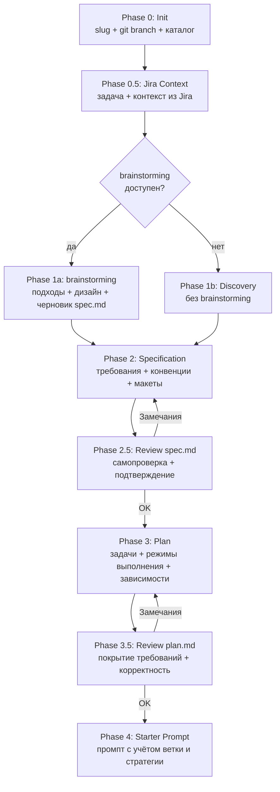

# Feature Planning

Структурированный процесс проектирования новых фич: от идеи до готового плана реализации.

## Процесс



---

## Phase 0: Init

1. Скажи пользователю: _«Использую скилл feature-planning для структурированного проектирования фичи.»_
2. Спроси **название фичи** (slug для каталога, например `dark-mode`).
3. **Обязательно** уточни про git-ветку:
   - «Создавать отдельную git-ветку для этой фичи?» Варианты: да (`feature/{slug}` по умолчанию), нет (работа в текущей ветке), другое имя ветки (пользователь указывает).
   - Зафиксируй решение в `README.md` в поле **Git-ветка:** (имя ветки или текст «не требуется»).
   - **Если отдельная ветка нужна:** зафиксируй в `README.md` поле **Базовая ветка для merge:** — это ветка, с которой ведётся работа *до* ответвления (обычно совпадает с целевой веткой для слияния после фичи). Получи имя через `git branch --show-current` в Phase 0 (пока не переключались на feature-ветку); если git недоступен или неоднозначно — спроси у пользователя: «В какую ветку мержить фичу по завершении?» и запиши ответ. Это поле нужно скиллу **feature-accept**, чтобы не гадать между `main`, `develop` и т.д.
   - **Если отдельная ветка не нужна:** в **Базовая ветка для merge:** укажи «не применимо» или опусти поле (в README достаточно одной строки «не применимо» для единообразия парсинга).
4. Создай структуру каталога и файлы-заглушки:

```
docs/features/{slug}/
├── README.md
├── jira-context.md   ← создаётся только если пользователь указал задачу Jira (Phase 0.5)
├── spec.md
├── plan.md
├── checklist.md
└── starter-prompt.md
```

5. В `checklist.md` в секции «Подготовка» оставь **один** пункт про git: либо создание/переключение на согласованное имя ветки, либо явная строка «Работа без отдельной ветки (см. README.md)» — убери плейсхолдер с фигурными скобками.

### Шаблон: README.md

```markdown
# Фича: {Title}

**Slug:** {slug}
**Jira:** {ключ задачи + ссылка или «не привязана»}
**Git-ветка:** {имя ветки, например `feature/{slug}` или «не требуется»}
**Базовая ветка для merge:** {имя, например `main` / `develop` — только при отдельной ветке: текущая ветка на момент планирования или явный ответ пользователя; иначе «не применимо»}
**Дата начала:** {YYYY-MM-DD}
**Статус:** Discovery

## Краткое описание

{Одно-два предложения}

## Ссылки

- [Спецификация](./spec.md)
- [План реализации](./plan.md)
- [Чеклист](./checklist.md)
- [Стартовый промпт](./starter-prompt.md)
- [Контекст задачи Jira](./jira-context.md)  ← добавить эту строку только если создан `jira-context.md`
```

### Шаблон: jira-context.md

Создаётся в Phase 0.5, если пользователь указал задачу Jira. Хранит полный снимок задачи — источник правды между сессиями (повторно к Jira не обязательно).

```markdown
# Контекст задачи Jira: {issueKey}

**Ссылка:** {URL}
**Заголовок:** {summary}
**Статус:** {status}  |  **Приоритет:** {priority}
**Исполнитель:** {assignee}

## Описание

{полный текст description из Jira — as-is}

## Acceptance Criteria

{если есть — извлечь из описания или отдельного поля; иначе «не указаны в задаче»}

## Ссылки из задачи

- Figma: {список найденных Figma-ссылок или «не найдены»}
- Прочие: {другие URL из описания/комментариев}

## Комментарии

### {автор} — {дата}
{текст комментария}

...

## Вложения

- {имя файла} ({тип})
- ...
```

### Шаблон: spec.md

```markdown
# Спецификация: {Title}

## Контекст

## Требования

## Ограничения

## Макеты и референсы

> Ссылки на Figma, скриншоты, описание референсов. Если макетов нет — «не применимо».

## Кодстайл и конвенции

> Ключевые правила проекта (линтеры, правила из CLAUDE.md и т.д.), чтобы реализация была консистентной.

## Переиспользуемые решения

> Список существующих компонентов, сервисов, утилит с путями — что брать за образец или вызывать повторно.

## Критерии приёмки

> Включи пункт: визуальное соответствие макету/скриншотам — **если** макеты или скриншоты предоставлены (если пользователь явно не оговорил иное).

## Затронутые файлы
```

### Шаблон: plan.md

```markdown
# План реализации: {Title}

## Обзор

## Задачи

| # | Задача | Файлы | Зависит от | Режим выполнения | Проверка |
|---|--------|-------|------------|------------------|----------|

**Режим выполнения** (одно значение на задачу):

- `sequential` — строго после указанных зависимостей, в общем порядке плана
- `parallel-subagent` — можно поручить отдельному субагенту параллельно с другими задачами того же этапа (нет пересечения по файлам и логике)
- `parallel-same` — можно выполнить параллельно в одной сессии (например, независимые мелкие правки)

## Стратегия выполнения

> Кратко: какие номера задач идут строго по цепочке, какие запускать параллельно. Обязательно добавь **mermaid flowchart** зависимостей между задачами (узлы — номера задач).

## Ревью после каждого шага

> Инструкция для исполнителя (дублируется в starter-prompt):
>
> - После каждой задачи — сверка с `plan.md` и `spec.md` (скоуп, критерии приёмки).
> - Проверка, что изменения не конфликтуют с параллельно выполняемыми задачами (одни и те же файлы, противоречивая логика).
> - Если задачу делал субагент — основной агент проводит ревью результата перед следующим шагом.
```

### Шаблон: checklist.md

```markdown
# Чеклист реализации: {Title}

## Подготовка
- [ ] Прочитать spec.md и plan.md (если есть `jira-context.md` — прочитать его как источник требований из Jira)
- [ ] {Если Git-ветка требуется: `Создать ветку \`{имя}\` и переключиться на неё` — иначе удалить этот пункт или заменить на «Работа без отдельной ветки (см. README.md)»}

## Задачи
> Заполняется в Phase 3 на основе plan.md

## Финализация
- [ ] Все проверки пройдены
- [ ] Код закоммичен
- [ ] Статус в README.md обновлён на `Done`
```

### Шаблон: starter-prompt.md

```markdown
# Стартовый промпт

> Заполняется в Phase 4 с учётом Git-ветки из README.md и секций «Стратегия выполнения» / «Ревью после каждого шага» из plan.md.
```

---

## Phase 0.5: Jira Context

Выполняется **сразу после Phase 0** (каталог и заглушки созданы), **до** уточняющих вопросов Phase 1.

### Когда включать

- Если в среде доступен MCP **Jira** (идентификатор сервера обычно `user-jira`, инструменты `jira_get_issue`, `jira_get_comments`) — **обязательно** спроси пользователя: есть ли задача Jira, по которой ведётся работа (ссылка вида `https://…atlassian.net/browse/PROJ-123` или ключ `PROJ-123`).
- Если Jira MCP **недоступен** — пропусти Phase 0.5 целиком и переходи к Phase 1.
- Если пользователь отвечает **нет** / **пропустить** / задачу не указывает — Phase 0.5 пропускается: в README оставь **Jira:** «не привязана», файл `jira-context.md` **не создавай**, строку со ссылкой на Jira в README не добавляй.

### Если задача указана

1. **Парсинг ключа:** из URL возьми сегмент после `/browse/` (например `PROJ-123`); если введён только ключ в формате `XXX-NNN` — используй как есть.
2. **Получение данных:** вызови параллельно `jira_get_issue` (аргумент `issueKey`) и `jira_get_comments` (тот же `issueKey`) на сервере Jira MCP.
3. **Извлечение контекста** из ответа задачи и комментариев:
   - описание (description), summary, статус, приоритет, исполнитель;
   - acceptance criteria — отдельное поле или явный блок в описании;
   - все URL, особенно Figma (`figma.com/design/…`, `figma.com/file/…`, `figma.com/proto/…`);
   - вложения/картинки (имена, типы; если в ответе API нет бинарных данных — зафиксируй факт наличия вложений текстом);
   - комментарии: по возможности **все**; если объём огромный — ключевые (доп. требования, решения, ссылки) + пометка, что список сокращён.
4. **Документация:**
   - Создай `docs/features/{slug}/jira-context.md` по шаблону выше (полное описание **as-is**, структурированные блоки для критериев, ссылок, комментариев, вложений).
   - В `README.md`: поле **Jira:** ключ + каноническая ссылка на задачу (если известен base URL — собери browse-URL; иначе ключ и ссылку как дал пользователь); добавь в «Ссылки» пункт на `./jira-context.md`.
   - Предзаполни `spec.md`: **Контекст** (кратко: цель из задачи), **Макеты и референсы** (Figma и прочие ссылки из `jira-context.md`); при отсутствии макетов — явно «не применимо» или ссылка только на описание в Jira.
5. **Figma:** если ссылки найдены — в Phase 1 при необходимости уточни макет через Figma MCP (если доступен); измеримые детали позже донеси в spec (Phase 2).

После записи `jira-context.md` и обновления README/spec **кратко покажи пользователю сводку** извлечённого контекста, затем переходи к Phase 1 — без дублирования вопросов, на которые уже ответила задача.

---

## Phase 1: Discovery

Цель — собрать контекст и требования.

**Сразу после Phase 0.5** определи, доступен ли скилл **brainstorming** из набора superpowers:

- в списке доступных скиллов агента есть запись с `name: brainstorming`.

Если доступен — выполняй **Phase 1a** (ниже). Если нет — **Phase 1b** (стандартный Discovery).

---

### Phase 1a: со скиллом brainstorming (superpowers)

1. **Загрузи скилл brainstorming** через Skill tool (`skill: "superpowers:brainstorming"`) и следуй его чеклисту до **одобрения дизайна пользователем** (исследование контекста → при необходимости Visual Companion → вопросы → 2–3 подхода → дизайн по секциям). Далее вместо записи в `docs/superpowers/specs/` перенеси результат в `spec.md` (см. п. 4) и выполни **цикл ревью спеки** из brainstorming (subagent), если в среде доступны инструкции и инструменты для него.
2. **Жёсткие ограничения для встраивания в feature-planning:**
   - **Не вызывай** скилл **writing-plans** и любые скиллы реализации из brainstorming — после завершения ветки brainstorming переходи к **Phase 2** этого скилла (формализация `spec.md` и далее по процессу feature-planning).
   - **Не пиши** отдельный файл в `docs/superpowers/specs/…-design.md`, если пользователь явно не попросил иное. Вместо этого переноси согласованный дизайн в **`docs/features/{slug}/spec.md`** (структура шаблона feature-planning).
3. **Что взять из brainstorming без изменений по смыслу:**
   - исследование контекста проекта (файлы, доки, недавние коммиты);
   - при необходимости **Visual Companion** — по правилам brainstorming (отдельное сообщение с предложением, опционально);
   - уточняющие вопросы **по одному**; с учётом `jira-context.md` — не дублировать то, что уже зафиксировано в задаче (как в Phase 1b §1.1);
   - **2–3 подхода** с компромиссами и рекомендация;
   - презентация дизайна по секциям с пошаговым одобрением пользователя;
   - после фиксации текста в `spec.md` — **цикл ревью спеки** (subagent `spec-document-reviewer`, если описан в superpowers и доступен), до 3 итераций, затем эскалация человеку.
4. **Маппинг одобренного дизайна → `spec.md`:** заполни (черновик или почти полный текст) секции «Контекст», «Требования», «Ограничения», «Макеты и референсы», при необходимости набросок «Критерии приёмки»; параллельно или сразу после — исследование кодовой базы как в Phase 1b §1.2 и заполнение «Кодстайл и конвенции», «Переиспользуемые решения», «Затронутые файлы» (если уже известны).
5. **После** прохождения цикла ревью brainstorming и подтверждения пользователем содержимого `spec.md` (кратко: «просмотри spec.md, нужны ли правки?») — переходи к **Phase 2** для пронумерованных REQ-* и финальной полноты секций.

---

### Phase 1b: стандартный Discovery (если brainstorming недоступен)

Цель та же — контекст и требования; шаги ниже — полный аналог прежней Phase 1.

#### 1.1 Обсуждение с пользователем

Веди как беседу, не все вопросы разом.

- **Если Phase 0.5 создал `jira-context.md`:** не задавай вопросы, ответы на которые уже есть в задаче; покажи краткую сводку (проблема, скоуп, ссылки, AC) и задавай только **уточняющие** вопросы по пробелам и неоднозначностям. Ссылки на Figma из Jira — основа для секции «Макеты и референсы» в `spec.md`.
- **Если Jira не использовался** — ключевые темы ниже.

Ключевые темы (если контекст из Jira не закрыл пункт):

- Какую проблему решает фича?
- Кто конечный пользователь / сценарий использования?
- Есть ли референсы (ссылки, скриншоты, примеры)?
- **Обязательно:** есть ли **макеты Figma или скриншоты**? Если да — сохрани ссылки и что считать эталоном. По умолчанию итоговый UI должен **соответствовать макету**, пока пользователь явно не сказал обратное (допуски, только логика без пикселей и т.д.).
- Какие ограничения известны (совместимость, перформанс)?
- Масштаб: мелкая доработка или крупная фича?

#### 1.2 Исследование кодовой базы

Параллельно с обсуждением — запусти Explore agent(ов) (Agent tool с subagent_type=Explore). **Обязательно** зафиксировать в `spec.md`. Если есть `jira-context.md` — опирайся на него как на источник формулировок требований и ссылок (вместе с уточнениями пользователя).

- Найти существующий код, связанный с фичей.
- **Кодстайл и структура:** линтеры, форматтеры, `CLAUDE.md`, конфиги ESLint/Prettier/tsconfig и т.п.
- **Консистентность:** паттерны именования, расположение файлов, как устроены похожие фичи — новые изменения должны выглядеть как часть проекта, а не «с нуля».
- **Переиспользование:** компоненты, сервисы, утилиты, хелперы, которые уже решают часть задачи; похожие экраны/модули — взять за образец реализации.
- Проверить наличие тестов, CI.
- Заполнить секции «Кодстайл и конвенции» и «Переиспользуемые решения» в `spec.md`.

#### 1.3 Обновить spec.md

Заполни «Контекст», черновик «Требования», «Макеты и референсы» (или «не применимо»), а также секции кодстайла и переиспользования по результатам обсуждения и исследования. При наличии `jira-context.md` согласуй формулировки с ним и не противоречь зафиксированному в задаче без явного согласования с пользователем.

---

## Phase 2: Specification

Цель — формализовать spec.md до состояния «можно реализовать».

Заполни все секции:

- **Контекст** — зачем нужна фича, как вписывается в архитектуру.
- **Требования** — пронумерованный список (REQ-1, REQ-2, ...).
- **Ограничения** — что НЕ входит в скоуп, технические лимиты.
- **Макеты и референсы** — ссылки на Figma/скриншоты или явное «не применимо».
- **Кодстайл и конвенции** — что обязательно соблюдать при реализации.
- **Переиспользуемые решения** — конкретные пути к существующему коду.
- **Критерии приёмки** — проверяемый чеклист; если есть макет/скриншоты — пункт про **визуальное соответствие** эталону (если пользователь не исключил).
- **Затронутые файлы** — конкретные пути.

**Если есть Figma:** по возможности используй MCP Figma (или доступные инструменты проекта) для уточнения макета; вынеси в спеку измеримые детали (отступы, типографика, цвета, состояния), чтобы приёмка была однозначной.

---

## Phase 2.5: Review spec.md

Перед тем как просить пользователя утвердить спецификацию:

1. Проведи **самопроверку** `spec.md` по чеклисту:
   - Все озвученные пользователем требования покрыты требованиями REQ-*?
   - Нет противоречий между требованиями и ограничениями?
   - Критерии приёмки проверяемы (можно сказать «выполнено / не выполнено»)?
   - Кодстайл и конвенции заполнены достаточно для консистентной реализации?
   - Макеты/скриншоты учтены в референсах и приёмке (или явно исключены)?
2. Кратко выведи пользователю **результат ревью** (ОК / список замечаний и правок).
3. При замечаниях — поправь `spec.md` и повтори ревью.
4. **ОБЯЗАТЕЛЬНО:** показать итоговый `spec.md` и получить подтверждение пользователя перед Phase 3.

---

## Phase 3: Implementation Plan

Цель — разбить реализацию на мелкие задачи с зависимостями и явной стратегией выполнения.

### Правила декомпозиции

- 1 задача = 1 логическое изменение (1–3 файла).
- У каждой задачи: описание, файлы, зависимости (`Зависит от: #N` или `—`), **режим выполнения** (`sequential` | `parallel-subagent` | `parallel-same`), способ проверки.
- Задачи с `parallel-subagent` / `parallel-same` должны быть **взаимно независимы** (нет общих файлов без договорённости, нет порядка API, который один шаг ломает другому).

### Группировка в блоки

Группируй задачи в именованные блоки:

```markdown
### Блок 1 — {название} (последовательно)

| # | Задача | Файлы | Зависит от | Режим выполнения | Проверка |
|---|--------|-------|------------|------------------|----------|
| 1 | Описание | `path/file.go` | — | sequential | `go test ./...` |
| 2 | Описание | `path/file.go` | 1 | sequential | `go build` |

### Блок 2 — {название} (параллельно после #2)

| # | Задача | Файлы | Зависит от | Режим выполнения | Проверка |
|---|--------|-------|------------|------------------|----------|
| 3 | Описание | `path/a.go` | 2 | parallel-subagent | unit test |
| 4 | Описание | `path/b.go` | 2 | parallel-subagent | unit test |
```

Добавь секции **«Стратегия выполнения»** (текстовый порядок: что за чем, что параллельно) и **mermaid flowchart** зависимостей между номерами задач.

Секция **«Ревью после каждого шага»** в `plan.md` должна содержать явные пункты:

- После каждой задачи — сверка с `plan.md` и `spec.md`.
- Проверка отсутствия конфликтов с другими задачами (особенно параллельными).
- После работы субагента — ревью результата перед продолжением.

### Заполнение чеклиста

После утверждения plan.md — заполни секцию «Задачи» в checklist.md на основе таблицы задач:

```markdown
## Задачи
- [ ] Задача #1: {описание}
- [ ] Задача #2: {описание}
...
```

---

## Phase 3.5: Review plan.md

Перед тем как просить пользователя утвердить план:

1. Проведи **самопроверку** `plan.md`:
   - Каждое требование из `spec.md` (REQ-*) покрыто хотя бы одной задачей (можно таблицу соответствия REQ → задачи).
   - Граф зависимостей без циклов, нет «висящих» задач без смысла.
   - Задачи с `parallel-subagent` / `parallel-same` действительно независимы.
   - Проверки реалистичны для проекта.
   - Явно используются пункты из «Переиспользуемые решения» там, где уместно.
2. Кратко выведи пользователю **результат ревью** (ОК / замечания).
3. При замечаниях — поправь `plan.md` (и при необходимости чеклист) и повтори ревью.
4. **ОБЯЗАТЕЛЬНО:** показать итоговый `plan.md` и получить подтверждение пользователя перед Phase 4.

---

## Phase 4: Starter Prompt

Сгенерируй starter-prompt.md — промпт для копирования в новую сессию.

### Формат

Учти **Git-ветку** и **Базовая ветка для merge** из `README.md`:

- Если ветка нужна — включи шаг с `git checkout -b {имя}` (или переключение на уже созданную ветку) и напомни: поле **Базовая ветка для merge** не трогать без причины — по нему скилл **feature-accept** подставляет цель слияния; если команда решила мержить в другую ветку — обнови README.
- Если «не требуется» — явно напиши: работать в текущей ветке, не создавать feature-ветку.

Шаблон тела промпта:

````markdown
# Стартовый промпт для реализации фичи «{Title}»

Скопируй целиком и вставь в новую сессию.

---

Реализуй фичу **{Title}** по подготовленной документации.

## Документация

- Спецификация: `docs/features/{slug}/spec.md` — прочитай перед началом
- План: `docs/features/{slug}/plan.md` — следуй порядку задач, секции «Стратегия выполнения» и «Ревью после каждого шага»
- Чеклист: `docs/features/{slug}/checklist.md` — отмечай прогресс
- Контекст Jira (если файл есть): `docs/features/{slug}/jira-context.md` — прочитай для исходных формулировок и ссылок из задачи

## Инструкции

1. Прочитай spec.md, plan.md и checklist.md целиком; если есть `jira-context.md` — прочитай его в первую очередь или сразу после spec.
2. {Git: если ветка нужна — «Создай/переключись на ветку `{имя}`». Если нет — «Отдельную ветку не создавай (см. README.md).»}
3. Отметь в checklist.md пункты «Подготовка» как выполненные.
4. Выполняй задачи согласно **стратегии выполнения** и зависимостям в plan.md: `sequential` — строго по порядку; `parallel-subagent` — можно вынести параллельным субагентам после выполнения зависимостей; `parallel-same` — параллельно в одной сессии, если инструмент позволяет.
5. После **каждой** задачи: ревью по plan.md и spec.md; убедись, что нет конфликта с параллельными задачами (общие файлы, противоречивая логика). Если задачу делал субагент — проверь результат перед следующим шагом.
6. После выполнения задачи — отметь её в checklist.md (`[x]`).
7. Запусти указанную для задачи проверку.
8. Коммить после каждого логического блока задач (или по правилам команды).
9. По завершении — отметь «Финализация» в checklist.md и обнови статус в README.md на `Done`.
10. Если что-то непонятно — спроси, не додумывай.
````

---

## Обновление статуса

После каждой фазы обнови поле «Статус» в README.md:

| После фазы | Статус |
|------------|--------|
| Phase 0 | `Discovery` |
| Phase 0.5 (Jira, при наличии MCP и задачи) | `Discovery` (без смены статуса; подготовка к Discovery) |
| Phase 1a (brainstorming) | `Specification` (черновик/основа в `spec.md` готова к Phase 2) |
| Phase 1b (Discovery без brainstorming) | `Specification` |
| Phase 2 | `Planning` |
| Phase 2.5 (spec утверждён) | `Planning` (переход к задачам плана) |
| Phase 3 | `Ready` |
| Phase 3.5 (plan утверждён) | `Ready` |
| Реализация начата | `In Progress` |
| Реализация завершена | `Done` |

---

## Правила

- **Не пропускать фазы.** Каждая — фундамент для следующей; Phase 2.5 и 3.5 обязательны перед переходом к плану и стартовому промпту. Phase 0.5 выполняй по условиям выше (MCP Jira + ответ пользователя); при пропуске не создавай `jira-context.md`. Phase 1 выполняется либо как **1a** (brainstorming, если скилл доступен), либо как **1b** (стандартный Discovery) — не обе ветки подряд.
- **Подтверждение пользователя** после Phase 2.5 (spec) и Phase 3.5 (plan).
- **Язык документации** — русский (код и пути файлов — как в проекте).
- **Не начинать реализацию** в рамках этого скилла — только планирование и документация.
